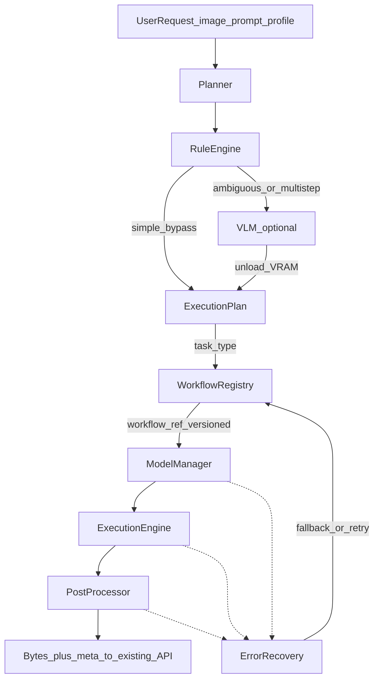

# AI Engine — Architecture

**Status:** Architecture freeze (documentation only)  
**Hardware target:** NVIDIA GeForce RTX 5060 Ti, **16311 MiB** (~16GB)  
**Execution runtime:** ComfyUI (local)  
**Application shell (unchanged):** FastAPI + React + MongoDB GridFS + scrub + deploy  

**Companion docs:** [WORKFLOWS.md](WORKFLOWS.md) · [MODELS.md](MODELS.md) · [IMPLEMENTATION_PLAN.md](IMPLEMENTATION_PLAN.md)

**Review date for model recommendations:** 2026-08-05

---

## 1. Purpose

Replace the current two generic graphs (Flux global img2img + Wan I2V) with a **modular AI Generation Layer** that:

- Classifies work via a **Rule Engine** (and VLM only when needed)
- Selects a **versioned workflow from the registry** by `task_type` (never hardcodes workflow names in the planner)
- Loads only required models for the chosen **quality profile**
- Executes on ComfyUI under a strict **16GB sequential VRAM** protocol
- Applies a dedicated **post-processing** chain
- Recovers from OOM, load failures, bad outputs, and workflow failures

This document defines module boundaries, routing, execution, recovery, performance, and measurable targets. Workflow inventories live in WORKFLOWS.md; model inventories and comparison tables live in MODELS.md.

---

## 2. What is out of scope for this layer

Unchanged and **not** redesigned here:

- Frontend SPA
- HTTP API surface (thin adapter later: `ai_engine.run()` behind `POST /api/generate`)
- Authentication, payments, multi-tenant auth
- MongoDB / GridFS persistence contract
- Zero-residue scrub policy
- Vercel / Render deployment topology

---

## 3. Overall architecture



### Design invariants

1. **Planner never selects a concrete workflow filename.** It emits `task_type` (+ hints). The **Workflow Registry** resolves the versioned workflow.
2. **No mixed responsibilities** across the five modules below.
3. **Adding a capability** = new workflow module + registry entry + model registrations. Existing workflows stay untouched.
4. **Model swaps** = Model Manager binding / replacement candidate changes. Backend routes and frontend stay untouched.

---

## 4. Module separation (strict)

| Module | Responsibility | Explicitly forbidden |
|--------|----------------|----------------------|
| **Planner** | Rule Engine + optional VLM → `ExecutionPlan` (`task_type`, targets, prompts, profile, perception flags) | Building Comfy graphs; loading diffusion weights; post-processing; downloading models |
| **Workflow Registry** | Store/resolve versioned workflows; expose metadata (VRAM, runtime, models, profiles, deps, fallbacks); supply graph builders by registry key | Planning; CUDA alloc; HTTP; persistence |
| **Model Manager** | Inventory, health, download metadata, ensure installed, lazy load, cache, unload, VRAM accounting, replacement candidates | Choosing tasks; composing node graphs; encoding video |
| **Execution Engine** | Materialize graph, call ComfyUI (upload/queue/WS/history/view), coordinate scrub hooks, return raw outputs + run stats | Intent classification; defining post chains; model registry schema |
| **Post Processor** | Face refine, color/lighting match, upscale, frame interpolation, video encode polish | Text→task routing; primary diffusion sampling |

**Error Recovery** is a cross-cutting policy invoked by Execution Engine / Model Manager / Post Processor. It does not own happy-path generation.

---

## 5. Planner

### 5.1 Rule Engine (always first)

Runs on every request **before** any VLM load.

**Jobs:**

1. Safety sanitize / policy gate
2. Input validation (image present, size limits, mode hints)
3. Confidence-scored **simple-task classification**
4. Decide: **bypass VLM** vs **invoke VLM**

**VLM bypass (high-confidence simple requests):**

| Pattern class | Example user text | Emitted `task_type` |
|---------------|-------------------|---------------------|
| Upscale | “upscale”, “4k”, “make sharper/larger” | `image.upscale` |
| Background remove | “remove background”, “cut out subject” | `image.background_remove` |
| Generic img2img | “img2img”, short single edit without multi-object ambiguity when `mode=img` and rules match | `image.img2img` |
| Image to video | “animate”, “make a video”, “img2vid”, `mode=vid` with simple motion | `video.i2v` |

Bypass plans set:

```json
{
  "planner_path": "rules",
  "task_type": "video.i2v",
  "confidence": 0.96,
  "requires_vlm": false
}
```

**VLM required when:**

- Ambiguous target (“fix it”, “improve this”)
- Multi-step or multi-region instructions
- Clothing / object / face / hair / product edits needing grounding phrases
- Combined style + identity constraints
- Rule confidence &lt; threshold (default **0.75**)

### 5.2 VLM planner (conditional)

- Planner code references only the logical slot **`planner.default_model`** (never a concrete vendor id like Qwen).
- Model Manager resolves `planner.default_model` → current binding in the Model Registry (initial binding may be Qwen2.5-VL-7B; swap to Qwen3-VL or another VLM by changing **one registry entry** + optional `replacement_candidates`).
- Fallback: if `planner.default_model` fails to load, try that record’s `replacement_candidates` (e.g. a smaller VLM) before degrading to rules-only.
- Runs **only** after Rule Engine requests it
- Must be **fully unloaded** before Model Manager loads generation/perception stacks
- Outputs structured plan fields; still emits `task_type`, **not** `clothing_replace.v2`

### 5.3 ExecutionPlan (contract)

```json
{
  "planner_path": "rules|vlm",
  "task_type": "edit.clothing_replace",
  "confidence": 0.91,
  "profile": "balanced",
  "channel": "stable",
  "targets": [{"label": "shirt", "role": "replace_region"}],
  "prompts": {
    "user": "Change shirt",
    "positive": "...",
    "negative": "...",
    "regional": [{"label": "shirt", "prompt": "..."}]
  },
  "perception": ["grounding", "sam2"],
  "identity": {"enabled": true, "method": "pulid"},
  "params_hints": {},
  "post_hints": ["face_detailer", "color_match"],
  "dev_workflow_id": null
}
```

`dev_workflow_id` is honored **only** in Developer Mode (see §11). Production always resolves via registry from `task_type`.

---

## 6. Workflow selection (registry-only)

```
task_type + channel + optional version_pin
        ↓
WorkflowRegistry.resolve(...)   # only enabled workflows; respect beta/experimental flags
        ↓
ModelManager.bind_backbone(workflow.preferred|compatible|minimum)
        ↓
workflow_ref = "clothing_replace.v2"   # example result
```

- Planner / API / frontend **must not** embed workflow version strings for normal operation.
- Registry picks highest **stable** version for `task_type` unless pinned.
- **Feature flags** (`enabled`, `beta`, `experimental`) gate visibility — see WORKFLOWS.md. Disabled workflows are never selected (except explicit Developer Mode pin).
- Production default: only `enabled=true` and `experimental=false` (and `beta=false` unless beta channel opted in).
- Backbone selection uses workflow **`preferred_models` → `compatible_models` → `minimum_models`** so missing preferred weights still run when a compatible/minimum model is installed.
- Fallbacks are registry fields (`fallback_workflow_ref`), not hardcoded in Execution Engine.

Full versioning schema and catalog: [WORKFLOWS.md](WORKFLOWS.md).

---

## 7. Model Manager

Owns all weight lifecycle:

- Resolve logical slots (e.g. `planner.default_model`) and workflow preferred/compatible/minimum tiers
- Query installed vs missing
- Expose download source, license, disk, VRAM
- `ensure(models, profile)` / `bind_backbone(workflow)` before execute
- Lazy load / unload / cache within budget
- Suggest `replacement_candidates` on load failure

Schema and comparison tables: [MODELS.md](MODELS.md).

---

## 8. Execution Engine

**Inputs:** resolved workflow record, ensured model bindings, ExecutionPlan, profile  
**Output:** media bytes, content type, run metrics, warnings  

**Steps:**

1. Ask workflow builder for Comfy API graph (nodes only for that task)
2. Upload inputs via existing Comfy client patterns
3. Queue + WS wait + history + view
4. Validate output (non-empty, decodable, min size)
5. Trigger scrub hooks (existing zero-residue policy)
6. Hand bytes to Post Processor per profile chain
7. Return to API adapter for GridFS store

Does **not** decide task type or which upscaler “feels right” beyond what the resolved profile specifies.

---

## 9. Post Processor

Separate pipeline after primary generation:

| Stage | Examples |
|-------|----------|
| Face | FaceDetailer, CodeFormer/GFPGAN (profile-gated) |
| Color / lighting | Match to source outside mask |
| Image upscale | UltraSharp / USDU / SeedVR2 per profile |
| Video interp | RIFE/FILM |
| Video upscale | Frame or SeedVR2 video |
| Encode | CreateVideo/SaveVideo params, bitrate |

Draft profiles may set `post: []`. Ultra may enable full chain within VRAM/time budgets.

---

## 10. Error recovery

| Failure | Recovery |
|---------|----------|
| **GPU OOM** | Unload caches → `torch`/Comfy free → retry once at next-lower profile → else registry `fallback_workflow_ref` → else fail with `OOM` code |
| **Model load failure** | Try `replacement_candidates` in order → mark model `missing` → fail with install hint from Model Manager |
| **Workflow execution error** | Retry once (same workflow) → resolve `fallback_workflow_ref` → fail |
| **Retry policy** | Max **2** attempts per stage; exponential backoff only for transient Comfy disconnects |
| **Corrupt / empty output** | Reject if size &lt; threshold or undecodable → retry once → fail `CORRUPT_OUTPUT` |
| **Comfy queue / timeout** | Respect `COMFYUI_TIMEOUT_SEC`; on timeout cancel/ignore orphan prompt id if API allows; clear history per scrub settings; return `TIMEOUT` |
| **Planner failure** | If VLM fails, degrade to Rule Engine best-effort or `task_type=image.img2img` with `warning=planner_degraded` when safe |

All recoveries must be **logged in generation `meta`** (`recovery_events[]`) for debugging.

---

## 11. Developer Mode

- Enabled via env (e.g. `AI_ENGINE_DEV_MODE=true`) and never by default in production UI.
- Allows `dev_workflow_id` (versioned registry key) and profile force.
- Still runs Rule Engine **safety** gates.
- Does not skip Model Manager ensure/health checks.

---

## 12. Performance — RTX 5060 Ti 16GB

### Sequential stages (mandatory)

```
Rules (CPU) 
→ optional VLM load → plan → VLM unload + cache clear
→ perception models load → masks → unload
→ generation models load → sample → unload
→ post models load → finish → unload
→ persist
```

### Required optimizations

| Technique | Policy |
|-----------|--------|
| **Sequential model loading** | One heavy stage resident at a time |
| **Smart unloading** | Explicit unload + CUDA cache empty between stages |
| **Lazy loading** | Load only models listed on resolved workflow+profile |
| **Model caching** | Optional pin for small hot models (matting/face detect) under a **cache budget** (e.g. ≤2GB reserved) |
| **GPU memory recovery** | After OOM/error: full stage teardown before retry |
| **Profile caps** | Ultra definitions must publish peak VRAM estimate ≤ ~14GB usable headroom |

### Runtime budgets (engineering targets, tune in IMPLEMENTATION_PLAN)

| Profile | Image edit p50 budget (guideline) | I2V p50 budget (guideline) |
|---------|-----------------------------------|----------------------------|
| Draft | ≤ 45s | ≤ 4 min |
| Balanced | ≤ 2.5 min | ≤ 10 min |
| Quality | ≤ 6 min | ≤ 20 min |
| Ultra | ≤ 15 min | ≤ 40 min |

Exact numbers are validated on-device and recorded in benchmarks—not marketing claims.

---

## 13. Measurable quality targets

**Do not** claim parity with ChatGPT Images, Kling, Magnific, Midjourney, Firefly, Runway, or Pika.

Use internal metrics:

| Area | Metric | Target (initial) |
|------|--------|------------------|
| Identity lock (face workflows) | InsightFace embedding cosine sim vs source | ≥ **0.55** mean on internal set (tune after baseline) |
| Background freeze (masked edits) | Mean abs pixel delta outside mask | ≤ **3%** of full-frame mean delta |
| Grounding+SAM | Mask IoU vs labeled fixtures | ≥ **0.70** mean |
| Upscale | Output meets profile resolution; no blank/NaN | **100%** valid decode |
| I2V start-frame fidelity | First-frame LPIPS vs source (lower better) | Track baseline; improve vs current 640² pipeline by ≥ **20%** relative LPIPS on fixture set |
| Reliability | Successful jobs / attempts under Balanced | ≥ **95%** excluding user input errors |
| Recovery | OOM retry success without process crash | **100%** process survival; ≥ **50%** successful degrade |

Benchmarks live with Model Manager scores (MODELS.md) and CI fixtures (implementation phase).

---

## 14. Folder structure (future code — design only)

```
backend/ai_engine/
  planner/
    rules.py              # Rule Engine
    vlm.py                # Conditional VLM
    schema.py             # ExecutionPlan
  registry/
    workflows.py          # Workflow Registry
    resolve.py            # task_type → versioned ref
  models/
    manager.py            # Model Manager
    catalog.py            # registry records
  runtime/
    engine.py             # Execution Engine
    recovery.py           # Error Recovery
    vram.py               # load/unload/cache budget
  post/
    pipeline.py           # Post Processor
  workflows/              # one package per logical id
    clothing_replace/
      v1.py
      v2.py
      experimental.py
    ...
```

---

## 15. Prompt intelligence

1. Rule Engine classifies / may short-circuit  
2. VLM (if used) expands targets, regional prompts, negatives, perception flags  
3. Workflow templates fill task-specific prompt scaffolds (identity lock language, garment materials, etc.)  
4. Persist `prompt_user`, `plan`, `workflow_ref`, `profile`, `recovery_events` in existing generation `meta`

User text is never sent “raw-only” as the sole Comfy positive when a workflow defines templates—except Developer Mode raw passthrough if explicitly enabled.

---

## 16. Future expansion

- New `task_type` + workflow versions without touching Planner code paths (rules/VLM vocab updates only)
- Swap Kontext → successor via Model Manager replacement candidates
- Wan → next I2V via model binding + new `video.i2v.vN`
- V2V / extend / audio (LTX) as new task types after I2V quality profiles meet runtime targets
- Optional async job queue in **application shell** (not required to complete AI Engine module design)

---

## 17. Known limitations

- **16GB VRAM** prevents concurrent VLM + 14B video + upscaler residency
- **FLUX.1 Kontext Dev** license may be non-commercial — product must gate usage by license policy
- **Synchronous HTTP** generate remains a shell constraint; long Ultra/I2V jobs risk proxy timeouts until async is added outside this layer
- Rule bypass can misclassify edge-case prompts; confidence threshold and logging mitigate
- Local model quality varies by domain; targets are measured, not assumed

---

## 18. Document map

| Doc | Role |
|-----|------|
| **AI_ENGINE.md** (this file) | Modules, routing, execution, recovery, performance, targets |
| **WORKFLOWS.md** | Versioning, profiles, task catalog, node chains |
| **MODELS.md** | Model registry schema, comparisons, replacements, scores |
| **IMPLEMENTATION_PLAN.md** | Phased build order, files, risks, exit criteria |
