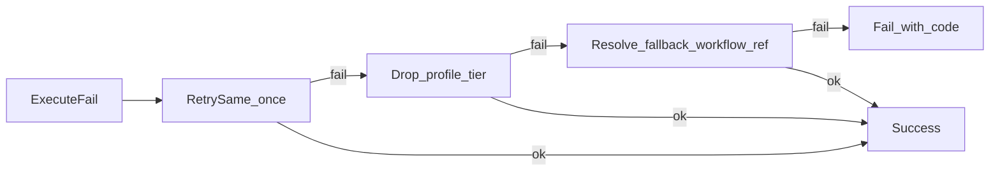

# AI Engine — Workflows

**Companion:** [AI_ENGINE.md](AI_ENGINE.md) · [MODELS.md](MODELS.md) · [IMPLEMENTATION_PLAN.md](IMPLEMENTATION_PLAN.md)

Workflows are selected **only** via the Workflow Registry from Planner `task_type`. Callers never hardcode `clothing_replace.v2` except Developer Mode pins.

---

## 1. Registry record schema (required fields)

Every workflow registration **must** include:

| Field | Type | Description |
|-------|------|-------------|
| `id` | string | Logical id, e.g. `clothing_replace` |
| `version` | string | `v1` \| `v2` \| `experimental` \| semver-like tag |
| `workflow_ref` | string | Full key: `{id}.{version}` e.g. `clothing_replace.v2` |
| `task_types` | string[] | Planner selection keys this workflow serves |
| `channel` | `stable` \| `experimental` | Default resolution filter |
| `enabled` | bool | If `false`, workflow is never auto-selected (instant kill switch; no redeploy of graph code) |
| `beta` | bool | If `true`, only selected when client/engine opts into beta channel |
| `experimental` | bool | If `true`, only Developer Mode or explicit experimental channel |
| `preferred_models` | model_id[] | Best backbone/stack bindings (try first) |
| `compatible_models` | model_id[] | Acceptable substitutes if preferred missing |
| `minimum_models` | model_id[] | Hard floor — workflow may run degraded if these alone are present; if none of preferred/compatible/minimum can bind → skip/fail |
| `optional_models` | model_id[] | Non-backbone extras (PuLID, ControlNet, etc.) that improve quality when present |
| `vram_mb_estimate` | int | Peak estimate for Balanced (document others in profiles) |
| `estimated_runtime_sec` | object | Per profile `{draft,balanced,quality,ultra}` |
| `quality_profiles` | object | See §2 |
| `dependencies` | object | `perception[]`, `post_default[]`, `depends_on_workflows[]` |
| `fallback_workflow_ref` | string \| null | Registry key to try on hard failure |
| `inputs` | schema | image/mask/reference requirements |
| `builder` | module path | Graph factory (implementation phase) |

`required_models` as a single flat list is **replaced** by the compatibility tiers above for backbone selection. Perception/post helpers still appear under `optional_models` and `dependencies.perception`.

### Versioning examples

```
clothing_replace.v1
clothing_replace.v2
clothing_replace.experimental
```

### Feature flags

```yaml
enabled: true          # master switch — set false to disable without code deploy
beta: false            # true → beta channel only
experimental: false    # true → experimental / Developer Mode only
```

Default production resolve includes only workflows with `enabled=true`, `experimental=false`, and (`beta=false` unless beta opted in).

### Model compatibility example (`clothing_replace`)

```yaml
preferred_models:
  - backbone.flux_kontext_dev_fp8
compatible_models:
  - backbone.flux_fill
  - backbone.flux_dev_fp8
minimum_models:
  - backbone.flux_dev_fp8
optional_models:
  - identity.pulid_flux
  - grounding.dino
  - seg.sam2
```

**Bind algorithm (Model Manager):**

1. Use first **installed** id in `preferred_models`  
2. Else first installed in `compatible_models`  
3. Else first installed in `minimum_models`  
4. Else workflow cannot run → try `fallback_workflow_ref` or error `MODEL_UNAVAILABLE`  
5. Attach `meta.backbone_model_id` + `meta.backbone_tier` (`preferred|compatible|minimum`) for debugging

### Resolution algorithm

1. If Developer Mode `dev_workflow_id` set → use exact ref if registered (may ignore `enabled` only when explicitly forced)  
2. Else filter by `task_type` ∈ `task_types`, `channel`, and feature flags (`enabled` / `beta` / `experimental`)  
3. Prefer highest stable `vN` (numeric) among remaining  
4. Attempt model bind via preferred → compatible → minimum  
5. If none, error `NO_WORKFLOW` / `MODEL_UNAVAILABLE` (do not invent names)

---

## 2. Quality profiles (every workflow)

Every workflow must define **Draft**, **Balanced**, **Quality**, **Ultra**.

Each profile object:

| Key | Meaning |
|-----|---------|
| `resolution` | Max box or exact W×H policy |
| `steps` | Sampler steps (or dual-stage total) |
| `cfg` | CFG or Flux guidance equivalent field |
| `sampler` | e.g. `euler` |
| `scheduler` | e.g. `simple` / `beta` |
| `post_processing` | Ordered post stage ids |
| `expected_runtime_sec` | Guideline on RTX 5060 Ti 16GB |
| `vram_mb_estimate` | Peak for this profile |

### Profile intent

| Profile | Goal |
|---------|------|
| **Draft** | Fast preview; minimal post; lower res/steps |
| **Balanced** | Default product path |
| **Quality** | Higher fidelity; full useful post |
| **Ultra** | Max fidelity inside 16GB headroom; longest runtime |

---

## 3. Task type catalog → workflow families

| `task_type` | Logical workflow `id` | Phase | Notes |
|-------------|----------------------|-------|-------|
| `image.upscale` | `image_upscale` | P1 | Rule bypass common |
| `image.background_remove` | `background_remove` | P1 | Rule bypass common |
| `image.img2img` | `image_img2img` | P1 | Rule bypass / simple edits |
| `edit.general_instruction` | `instruction_edit` | P1 | Kontext-class |
| `edit.object_replace` | `object_replace` | P1 | Masked Fill |
| `edit.clothing_replace` | `clothing_replace` | P1 | Garment + identity |
| `edit.face` | `face_edit` | P1 | PuLID + detailer |
| `edit.hair` | `hair_edit` | P1 | Hair matting + Fill |
| `edit.background` | `background_replace` | P1 | Matting + Fill/Kontext |
| `edit.product` | `product_edit` | P1 | Subject isolate + studio |
| `edit.style_transfer` | `style_transfer` | P1 | Global style |
| `edit.character_consistency` | `character_consistency` | P1 | Identity-heavy |
| `edit.face_swap` | `face_swap` | P1 | Swap stack only if classified |
| `edit.inpaint` | `inpaint` | P1 | Masked |
| `edit.outpaint` | `outpaint` | P1 | Canvas expand |
| `edit.remove_object` | `object_remove` | P1 | Mask + Fill remove |
| `edit.add_object` | `object_add` | P1 | Placement mask |
| `edit.restore` | `image_restore` | P1 | Face/restore models |
| `video.i2v` | `video_i2v` | P2 | Rule bypass common |
| `video.v2v` | `video_v2v` | Later | Designed, post-I2V |
| `video.upscale` | `video_upscale` | P2 | |
| `video.extend` | `video_extend` | Later | |
| `video.interpolate` | `video_interpolate` | P2 | Often post stage |

Legacy bridge (Phase 1 implementation only): register current graphs as `image_img2img.v0_legacy` and `video_i2v.v0_legacy` so the registry is the only entry point without quality regression.

---

## 4. Profile templates (defaults to specialize per workflow)

Values are **starting points** for 16GB; tune with benchmarks.

### 4.1 Instruction / surgical image family

| Profile | Resolution | Steps | CFG / guidance | Sampler | Scheduler | Post | Runtime guide |
|---------|------------|-------|----------------|---------|-----------|------|---------------|
| Draft | ≤768² box | 12–16 | guidance 3.0 | euler | simple | none | ≤45s |
| Balanced | ≤1024² | 24–28 | 3.5 | euler | simple | color_match | ≤2.5m |
| Quality | ≤1280² | 32–36 | 4.0 | euler | beta | face_detailer + color_match + upscale.conservative | ≤6m |
| Ultra | ≤1536² if VRAM allows else 1280² | 40–48 | 4.0–4.5 | euler/deis | beta | full face + USDU/UltraSharp | ≤15m |

### 4.2 Upscale-only family

| Profile | Resolution | Steps | CFG | Sampler | Scheduler | Post | Runtime guide |
|---------|------------|-------|-----|---------|-----------|------|---------------|
| Draft | 2× | tile light | n/a or 1.0 | — | — | UltraSharp 2× | ≤30s |
| Balanced | 2×–3× | USDU moderate | — | — | — | UltraSharp | ≤90s |
| Quality | 4× class | USDU + refine | — | — | — | UltraSharp + light face | ≤4m |
| Ultra | 4× + face | USDU heavy / SeedVR2 if fits | — | — | — | face restore | ≤10m |

### 4.3 Background remove family

| Profile | Resolution | Steps | CFG | Sampler | Scheduler | Post | Runtime guide |
|---------|------------|-------|-----|---------|-----------|------|---------------|
| Draft | source | matting only | — | — | — | alpha composite | ≤15s |
| Balanced | source | BiRefNet | — | — | — | edge refine | ≤30s |
| Quality | source | BiRefNet + refine | — | — | — | hair matting polish | ≤60s |
| Ultra | source | dual pass matting | — | — | — | manual-grade edge | ≤2m |

### 4.4 Video I2V family

| Profile | Resolution | Steps | CFG | Sampler | Scheduler | Post | Runtime guide |
|---------|------------|-------|-----|---------|-----------|------|---------------|
| Draft | ≤480²–512², length ~33, 16fps | 8–12 or LightX2V 4-step | 3.0 | euler | simple | encode only | ≤4m |
| Balanced | ≤640²–720p short side, length 49, 16fps | 20 | 3.5 | euler | simple | encode | ≤10m |
| Quality | 720p-class, length 49–81, 16→24 interp | 30–36 | 3.5–4.0 | euler/uni_pc* | simple/beta* | RIFE + mild upscale | ≤20m |
| Ultra | max stable 720p on 16GB, longer length if fits | 40 | 3.5–4.0 | tuned | tuned | RIFE + video upscale | ≤40m |

\*Final sampler/scheduler locked after on-device A/B; registry stores the winner per version.

---

## 5. Workflow designs (node-level)

Notation: logical model ids refer to MODELS.md. Perception/post stages are dependencies, not optional commentary.

### 5.1 `image_upscale` (v1)

**task_types:** `image.upscale`  
**flags:** `enabled: true`, `beta: false`, `experimental: false`  
**preferred_models:** `upscale.ultrasharp_4x`  
**compatible_models:** `upscale.seedvr2`  
**minimum_models:** `upscale.ultrasharp_4x`  
**optional_models:** face restore ids  
**fallback:** none (fail if no upscaler binds)  
**deps:** `perception: []`, `post_default: []` (upscale IS the workflow)

```
LoadImage → UpscaleModelLoader → ImageUpscale / UltimateSDUpscale → (optional FaceRestore) → SaveImage
```

### 5.2 `background_remove` (v1)

**task_types:** `image.background_remove`  
**flags:** `enabled: true`, `beta: false`, `experimental: false`  
**preferred_models:** `matting.birefnet`  
**compatible_models:** `matting.rmbg2`  
**minimum_models:** `matting.birefnet`  
**fallback:** bind alternate matting via compatible tier / Model Manager replacement

```
LoadImage → BiRefNet/RMBG → Alpha composite / Save image with alpha or solid bg per params → SaveImage
```

### 5.3 `image_img2img` (v1)

**task_types:** `image.img2img`  
**flags:** `enabled: true`, `beta: false`, `experimental: false`  
**preferred_models:** `backbone.flux_dev_fp8`  
**compatible_models:** `backbone.flux_kontext_dev_fp8`  
**minimum_models:** `backbone.flux_dev_fp8`  
**optional_models:** `identity.pulid_flux`, CLIP-L, T5, AE (encoders/VAE treated as deps of chosen backbone)  
**fallback:** `instruction_edit.v1` if Kontext binds and img2img fails

```
LoadImage → ImageScale → VAEEncode → UNET+DualCLIP+VAE → FluxGuidance → KSampler(denoise mid) → VAEDecode → SaveImage
```

### 5.4 `instruction_edit` (v1)

**task_types:** `edit.general_instruction`  
**flags:** `enabled: true`, `beta: false`, `experimental: false`  
**preferred_models:** `backbone.flux_kontext_dev_fp8`  
**compatible_models:** `backbone.flux_dev_fp8`  
**minimum_models:** `backbone.flux_dev_fp8`  
**optional_models:** `identity.pulid_flux`  
**fallback:** `image_img2img.v1`

```
LoadImage → Kontext instruction graph (native Comfy Kontext nodes) → optional PuLID → Decode → optional FaceDetailer → SaveImage
```

### 5.5 `object_replace` / `object_remove` / `object_add` / `inpaint` (v1)

**Shared pattern:** ground → segment → Fill  
**flags:** `enabled: true`, `beta: false`, `experimental: false` (disable individually per workflow_ref if one path breaks)  
**preferred_models:** `backbone.flux_fill`  
**compatible_models:** `backbone.flux_kontext_dev_fp8`, `backbone.flux_dev_fp8`  
**minimum_models:** `backbone.flux_dev_fp8`  
**optional_models:** `grounding.dino`, `seg.sam2`, depth/pose ControlNet, PuLID  
**fallback:** `instruction_edit.v1` with warning `mask_failed`

```
LoadImage
→ GroundingDINO(plan.targets)
→ SAM2(boxes→masks) → morph grow/blur
→ (object_remove: mask=object; object_add: placement mask; replace: object mask)
→ Flux Fill / Inpaint conditioning
→ optional ControlNet depth
→ KSampler
→ VAEDecode
→ color_match outside mask
→ SaveImage
```

### 5.6 `clothing_replace` (v1 → v2)

**v1:** garment mask + Fill + PuLID  
**v2 (target):** + pose/depth lock + improved garment seg prompt templates  

**flags:** `enabled: true`, `beta: false`, `experimental: false`  
**preferred_models:** `backbone.flux_kontext_dev_fp8`  
**compatible_models:** `backbone.flux_fill`, `backbone.flux_dev_fp8`  
**minimum_models:** `backbone.flux_dev_fp8`  
**optional_models:** `identity.pulid_flux`, `grounding.dino`, `seg.sam2`, `controlnet.flux_depth`  
**fallback:** `object_replace.v1`

```
LoadImage → Ground(garment phrase) → SAM2 → (optional pose/depth) → Fill + PuLID → Decode → FaceDetailer → color_match → SaveImage
```

### 5.7 `face_edit` / `hair_edit` / `face_swap` (v1)

**face_edit:** face bbox/mask → PuLID + masked edit + FaceDetailer  
**hair_edit:** hair-oriented mask/matting → Fill + PuLID  
**face_swap:** ReActor/InsightFace **only** when `task_type=edit.face_swap`  

**fallback:** `instruction_edit.v1`

### 5.8 `background_replace` (v1)

```
LoadImage → BiRefNet subject matte → invert/bg mask → Fill or Kontext bg prompt → lighting match → SaveImage
```

### 5.9 `product_edit` (v1)

Subject matting → controlled background → optional shadow → mild upscale on Quality+

### 5.10 `style_transfer` / `character_consistency` (v1)

Kontext global + optional IPAdapter/PuLID weights per identity flag.

### 5.11 `outpaint` (v1)

Pad canvas → outpaint mask → Fill outpaint → blend seams → SaveImage

### 5.12 `image_restore` (v1)

Optional light denoise + CodeFormer/GFPGAN; Draft = restore only.

### 5.13 `video_i2v` (v1 quality rebuild; v0_legacy = current)

**flags:** `enabled: true`, `beta: false`, `experimental: false` (`v0_legacy` may stay enabled until v1 passes exit criteria, then set `enabled: false`)  
**preferred_models:** `video.wan22_i2v_high_fp8` + paired low-noise (stack)  
**compatible_models:** `video.wan22_ti2v_5b`  
**minimum_models:** `video.wan22_ti2v_5b`  
**optional_models:** LightX2V LoRAs (Draft), RIFE, upscaler, Wan VAE binding  
**fallback:** Draft profile or TI2V-5B via compatible/minimum bind

```
LoadImage → prep dims
→ WanImageToVideo
→ ModelSamplingSD3 high/low
→ KSamplerAdvanced ×2
→ VAEDecode
→ CreateVideo
→ (Quality+: RIFE) → (Ultra: upscale frames)
→ SaveVideo
```

Motion: Planner/rules supply motion hints; workflow maps to prompt scaffold (camera pan/zoom amplitude). No hardcoded workflow name in planner.

### 5.14 `video_interpolate` / `video_upscale` (v1)

Often invoked as post dependencies of `video_i2v` profiles; also callable as standalone `task_type` when user asks only to interp/upscale an existing video (future input type).

### 5.15 `video_v2v` / `video_extend` (designed)

Registered as experimental after I2V meets runtime/reliability targets. Extend = last-frame chain / overlapping windows with continuity prompts.

---

## 6. Fallback graph (registry-driven)



---

## 7. Adding a new workflow (modularity checklist)

1. Implement builder under `workflows/{id}/vN.py` (implementation phase)  
2. Register record with **all required fields** (§1) including profiles, feature flags, and preferred/compatible/minimum models  
3. Ensure referenced `model_id`s exist in Model Manager  
4. Set `fallback_workflow_ref`  
5. Add `task_types` mapping  
6. Ship with `enabled: false` or `beta: true` until fixtures pass, then flip flags without code change  
7. Add fixture + runtime benchmark row  

**Do not** edit unrelated workflow modules or hardcode the new name in Planner — update Rule/VLM vocab to emit the new `task_type` only.

---

## 8. Measurable workflow targets

| Workflow family | Metric | Initial target |
|-----------------|--------|----------------|
| Masked edits | Outside-mask pixel delta | ≤ 3% vs full-frame edit delta |
| Clothing/face | Face identity cosine | ≥ 0.55 on fixtures |
| Upscale | Valid output at profile res | 100% |
| I2V Balanced | Complete under timeout; start-frame LPIPS improve vs legacy v0 | ≥ 20% relative improvement |
| Registry | resolve(task_type) never returns unregistered string | 100% in tests |
