# Wan Studio — Architecture (Mermaid)

Draw.io–style views of the **current** Wan Studio system: deployment, components, data, and sequential flows.

> **Media policy (current):** originals and thumbs live in **MongoDB Atlas GridFS only**. No local lasting gens on the GPU PC. Openinary / R2 was explored and **cancelled** — slow library load via GridFS is accepted.

**How to view:** open this file in Cursor / GitHub / any Mermaid preview.

Repo: [wellswenger-svg/Maal](https://github.com/wellswenger-svg/Maal) · URLs: [`PRODUCTION_URLS.md`](PRODUCTION_URLS.md)

---

## Table of diagrams

1. [System context](#1-system-context)
2. [Deployment topology](#2-deployment-topology)
3. [GPU PC edge](#3-gpu-pc-edge)
4. [Component architecture](#4-component-architecture)
5. [Data model](#5-data-model)
6. [Auth unlock](#6-auth-unlock)
7. [Job generate — full sequence](#7-job-generate--full-sequence)
8. [AI engine flow](#8-ai-engine-flow)
9. [ComfyUI contract](#9-comfyui-contract)
10. [Library + thumbs (GridFS)](#10-library--thumbs-gridfs)
11. [Delete](#11-delete)
12. [Admin ops](#12-admin-ops)
13. [Scrub / zero-residue](#13-scrub--zero-residue)

---

## 1. System context

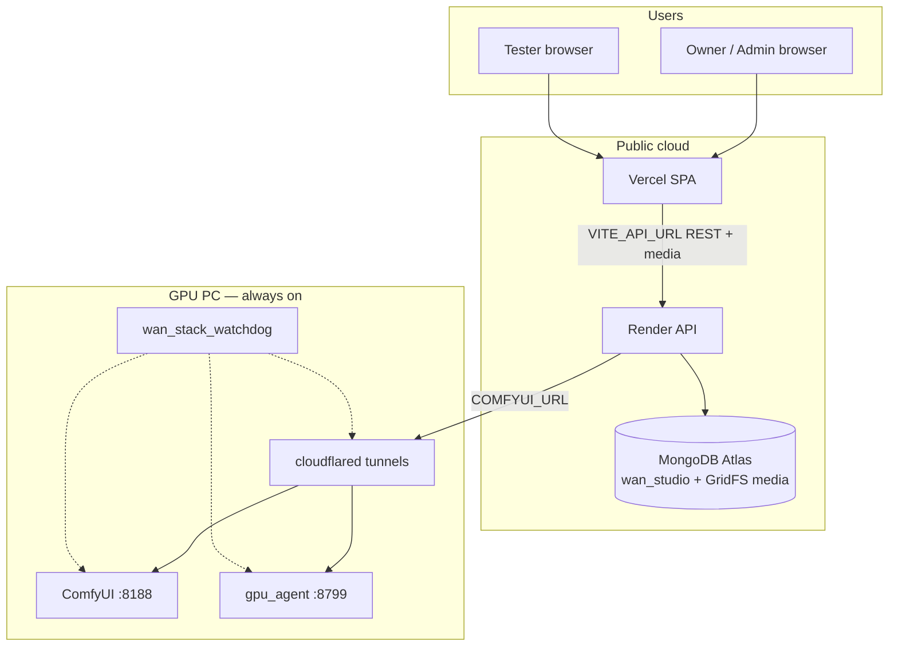

---

## 2. Deployment topology

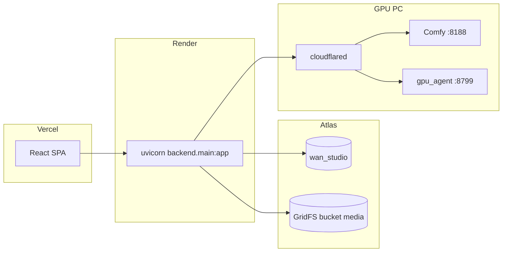

| Service | URL |
|---------|-----|
| Frontend | https://frontend-six-chi-37.vercel.app |
| API | https://wan-studio-api.onrender.com |
| GitHub | https://github.com/wellswenger-svg/Maal |

---

## 3. GPU PC edge

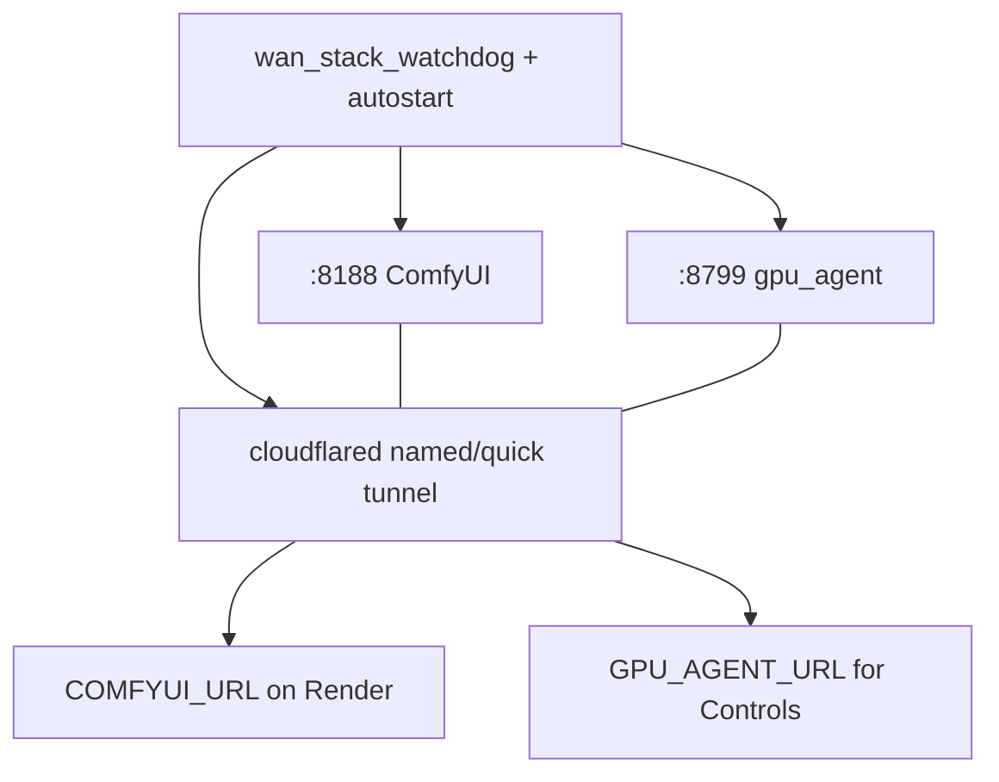

No lasting gens on this PC — Comfy artifacts are scrubbed after each job.

---

## 4. Component architecture

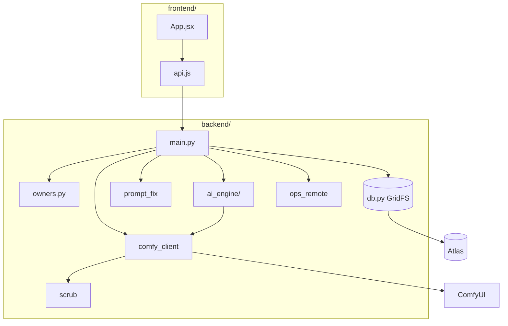

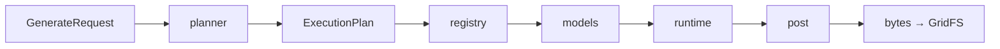

---

## 5. Data model

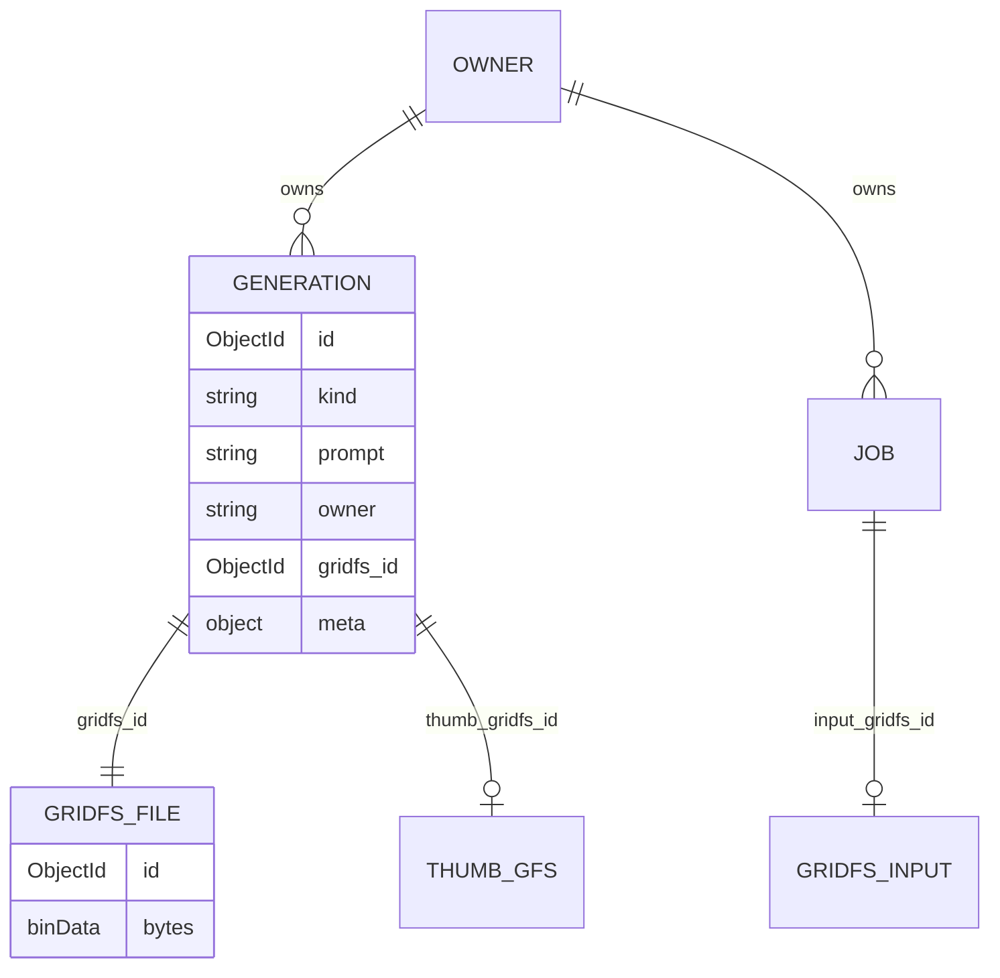

---

## 6. Auth unlock

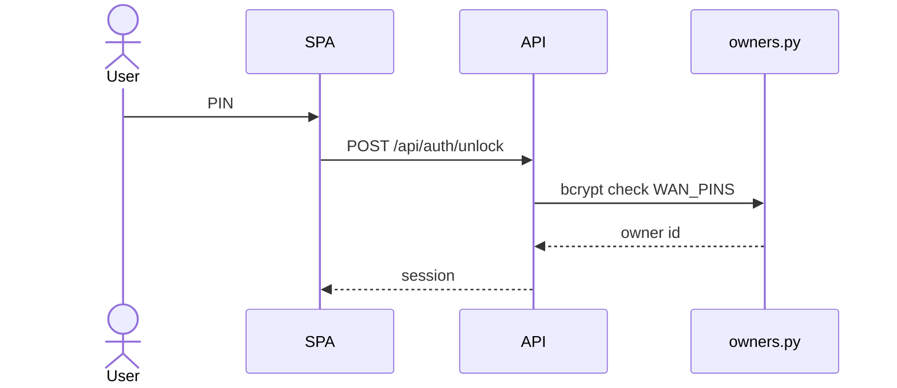

---

## 7. Job generate — full sequence

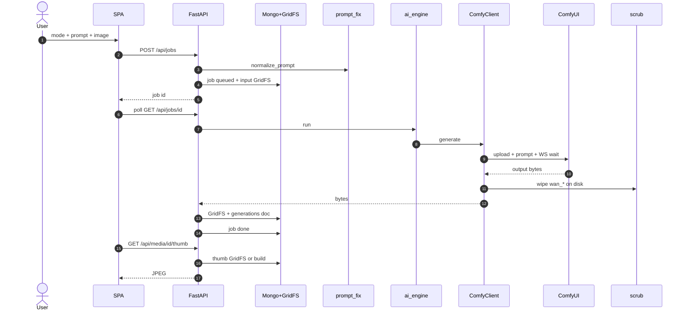

---

## 8. AI engine flow

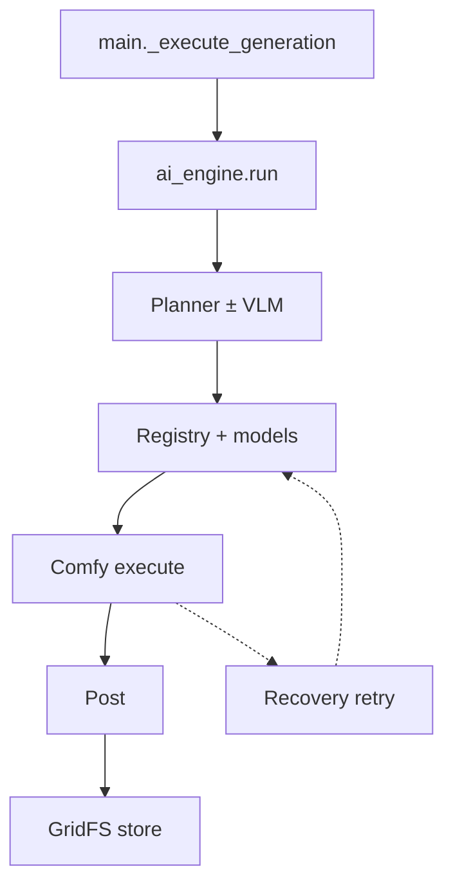

---

## 9. ComfyUI contract

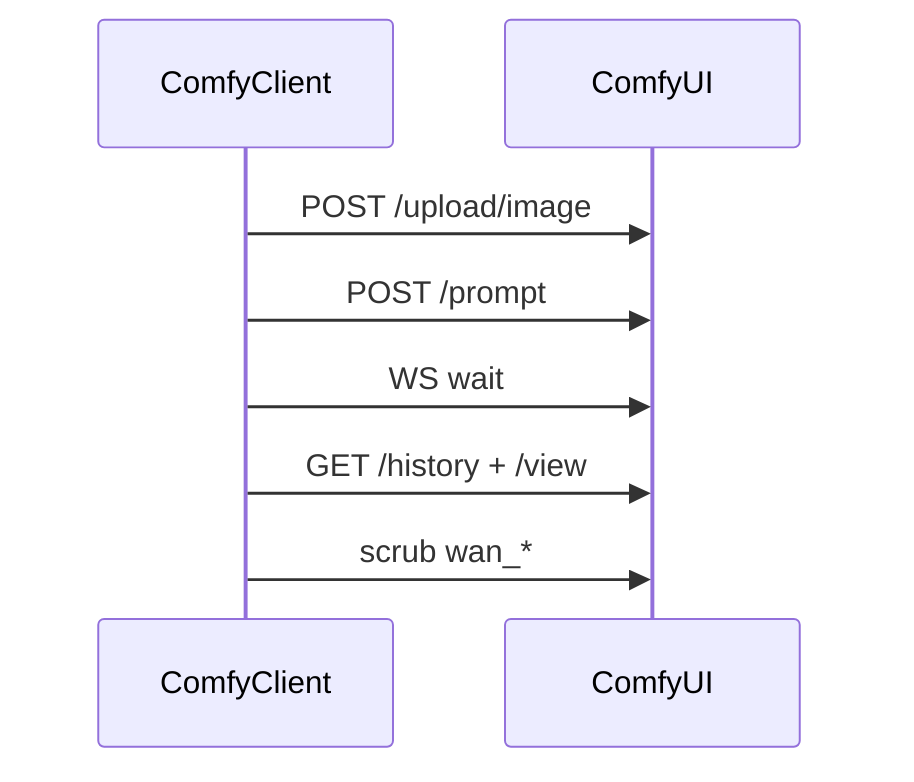

---

## 10. Library + thumbs (GridFS)

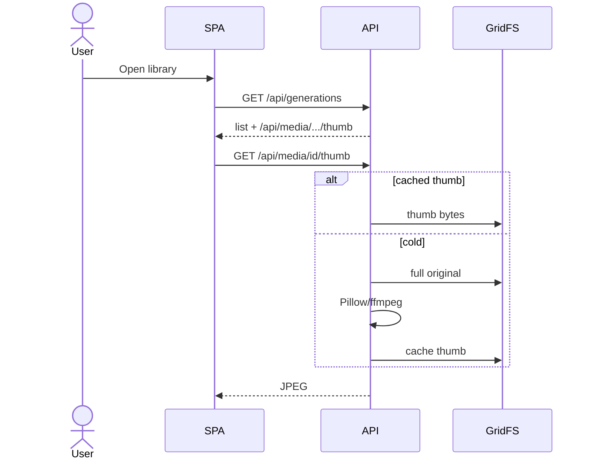

---

## 11. Delete

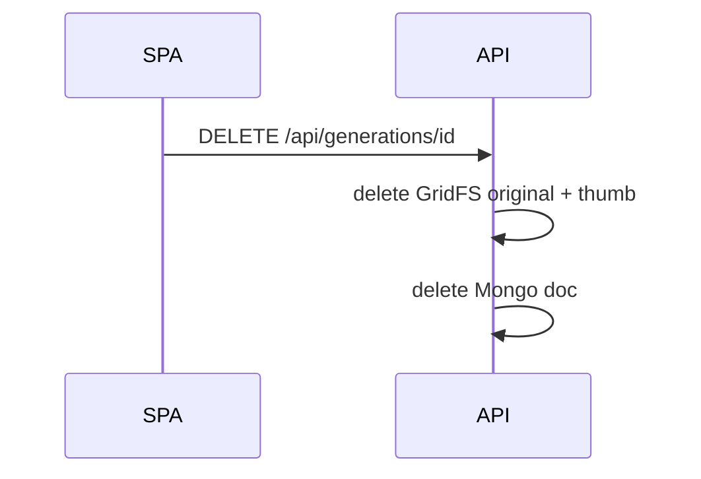

---

## 12. Admin ops

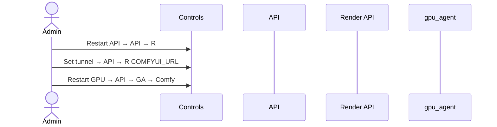

---

## 13. Scrub / zero-residue

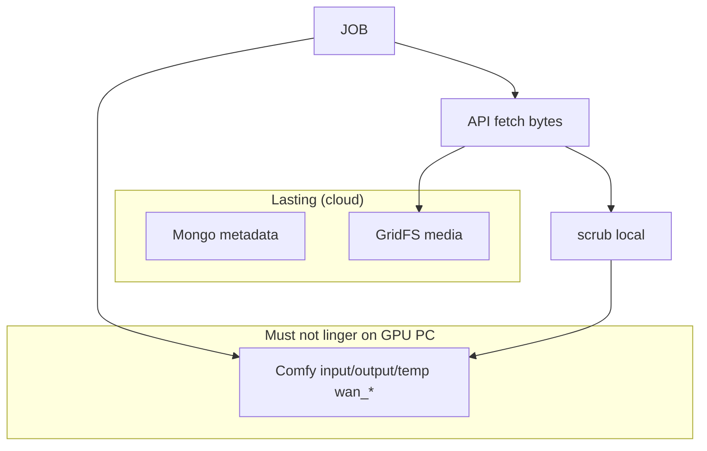

---

## Related

| Doc | Role |
|-----|------|
| [`TECHNICAL.md`](TECHNICAL.md) | Module detail |
| [`AI_ENGINE.md`](AI_ENGINE.md) | Planner / VRAM |
| [`PRODUCTION_URLS.md`](PRODUCTION_URLS.md) | Deploy URLs |
| [`media.md`](media.md) | Where files live |
